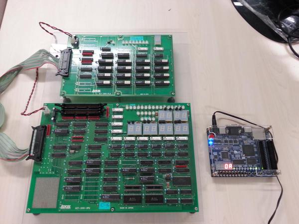

# CEDC on DE0

## CDEC とは

 - Computer Design Education Computer
 - コンピュータアーキテクチャを学ぶためのシンプル8ビットコンピュータ実習ボード
 - コンピュータ内部の動作の仕組みを体験的に学ぶことができる
 - 木村真也氏(群馬工業高等専門学校教授)と鹿股昭雄氏(元　仙台高等専門学校教授)により開発
 - 参考図書：木村真也、鹿股昭雄 著、日刊工業新聞社 (1996/10)、[原理がわかる工学選書　コンピュータ回路工学編　コンピュータの原理と設計](http://www.amazon.co.jp/%E3%82%B3%E3%83%B3%E3%83%94%E3%83%A5%E3%83%BC%E3%82%BF%E3%81%AE%E5%8E%9F%E7%90%86%E3%81%A8%E8%A8%AD%E8%A8%88-%E5%8E%9F%E7%90%86%E3%81%8C%E3%82%8F%E3%81%8B%E3%82%8B%E5%B7%A5%E5%AD%A6%E9%81%B8%E6%9B%B8%E2%80%95%E3%82%B3%E3%83%B3%E3%83%94%E3%83%A5%E3%83%BC%E3%82%BF%E5%9B%9E%E8%B7%AF%E5%B7%A5%E5%AD%A6%E7%B7%A8-%E6%9C%A8%E6%9D%91-%E7%9C%9F%E4%B9%9F/dp/4526039187)(絶版)

 

## CDEC on DE0 とは

 - CDECを[Altera DE0 開発・学習ボード](http://www.terasic.com.tw/cgi-bin/page/archive.pl?Language=English&CategoryNo=56&No=364)上のFPGA(Cyclone III EP3C16F484)で実装
 - DE0ボードのスイッチ、ボタン、LED等の入出力デバイスによって、CDECへのプログラム書き込み、1クロック毎でのプログラムの実行を行うことができる
 - 回路はVerilog HDLで記述
 - 群馬工業高等専門学校 木村真也教授が開発したCDEC-TNGのVerilog HDLによるデザインファイルをベースに開発

## files

 - src/                   -- デザインファイル一式
  - CPU_shell.v　　         -- CDECと実習装置(DE0)のインターフェース部
  - CDEC8.v　              -- CDEC本体の最上位
  - CDEC8_DP.v　           -- データ・パス部
  - DEC8_PLA.v　           -- PLA制御部
  - alu.v                 -- ALU
  - register.v　           -- レジスタ
  - tbuf_func.v　          -- ３ステート・バッファ・ファンクション
  - ram.v                 -- メモリー
  - memory_programmer.v   -- メモリーへのプログラム書き込み回路
  - sseg_dec.v            -- 7SEG LED用デコーダ
  - my_const.vh　          -- 定数定義

 - simulation/            -- 検証用のおシミュレーションファイル一式

## License

検討中